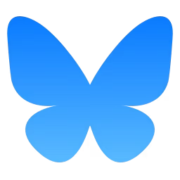

 # Hello, I'm Michelle - aka [SlimBloodworth]👋
 [michellerenee.dev](https://michellerenee.dev)
 
- 🌱 I’m a front-end web and email developer and designer, also experienced in content creation and digital marketing.
- 👀 View my [Certifications](https://github.com/SlimBloodworth/Michelle-Renee-Certifications)
- 👀 View my [Portfolio](https://michellerenee.dev)
- 🥅 2025 Goals: Contribute to open source projects and grow my solo agency.
- ⚡ Fun fact: I was a stand-up comic for 20 years.
- ⚡ Another Fun fact: I have an extensive hat collection.

## 

## Connect with me:

&nbsp;&nbsp;

## 

## Languages and Tools:

<!--  -->

<!---
SlimBloodworth/SlimBloodworth is a ✨ special ✨ repository because its `README.md` (this file) appears on your GitHub profile.
You can click the Preview link to take a look at your changes.
--->
