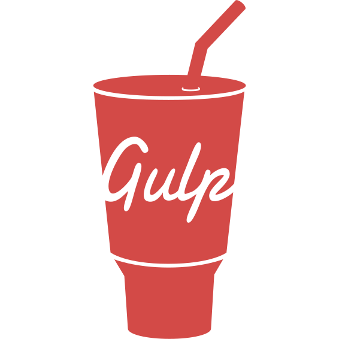

 # Hello, I'm Michelle - aka [SlimBloodworth]👋
 [My Website](https://slimbloodworth.editorx.io/portfolio)
 
- 🌱 I’m a UI developer and web designer.
- 👀 View my [Certifications](https://github.com/SlimBloodworth/Michelle-Renee-Certifications)
- 👯 I’m looking to collaborate with other content creators.
- 🥅 2023 Goals: Contribute to open source projects.
- ⚡ Fun fact: I was a stand up comic for 20 years.
- ⚡ Another Fun fact: I have an extensive hat collection.
- 👀 I’m currently interested collaborating with other contributors.
- 💞️ I’m self taught and looking to learn from others as well!
- 📫 How to reach me by email SlimBloodworth@gmail.com

## 

## Connect with me:

  

  

## 

## Languages and Tools:

<!---
SlimBloodworth/SlimBloodworth is a ✨ special ✨ repository because its `README.md` (this file) appears on your GitHub profile.
You can click the Preview link to take a look at your changes.
--->
